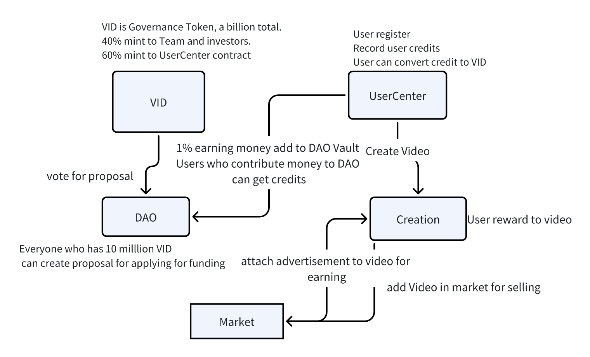

# Video DAO
Video DAO is a Decentralized video creation platform. Eevery video is a NFT in our platform. Creators can sell their Vedio. 
Creators also can accept advertisement for earning money. Users can reward money for vedio they think great.
1% of all earned money goes into the DAO vault, also contributor can get Governance Token. Everyone can creat 
a proposal for Applying for fund to do something. Everyone who have Governance Token can vote.

## Overview

1. Everyone can create a account becoming Video DAO User in UserCenter contract. 
2. User can create video in Creation contract. And video information save in **IPFS**.
3. User can reward to a video, owner of Video will get this money.(1% of the money will go to DAO, and get credits)
4. User can list their videos in market for selling, and 1% earning money will be  go to DAO, and get credits.
5. User can accept an advertisement in market for earning money, and 1% of earning money will be go to DAO, and get credits.
6. User can convert their credits to VID token if the UserCenter has balance.
7. Who has 10 million VID can propose a proposal.  And who has VID get vote to the proposal. A proposal now is main to get money for doing something like building a application for Vedio DAO platform.  Proposal detail information will be saved in **IPFS**.

Video DAO contracts will be deployed in **Polygon**、 **Mantle**、**Arbitrum** or any EVM evm compatible L2.
